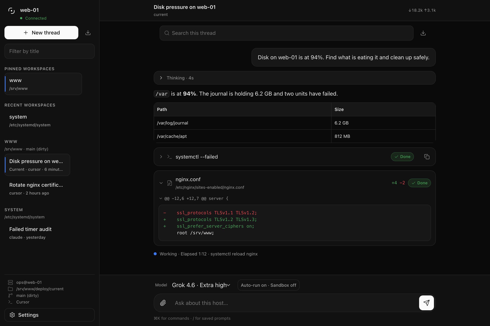
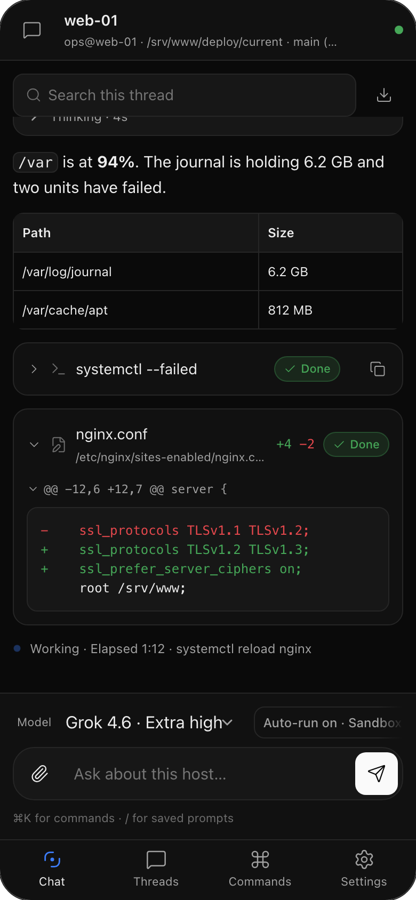

<p align="center">
  
</p>

<div align="center">

<h3>
  <a href="#english">English</a> | <a href="#español">Español</a>
</h3>

</div>

<p align="center">
  <a href="https://github.com/KN990x/Glassys/stargazers">
    
  </a>
  &nbsp;
  <a href="https://github.com/KN990x/Glassys/issues">
    
  </a>
  &nbsp;
  <a href="./LICENSE">
    
  </a>
  &nbsp;
  
</p>

<p align="center">
  
  &nbsp;
  
  &nbsp;
  
</p>

<p align="center">
  
</p>

<p align="center">
  
</p>

<a id="english"></a>

# Glassys

Glassys is a self-hosted **chat face** for the coding agent that already runs on your machine. It is not the agent. The job is **systems work** on that host (the machine, files, services, git) from a phone or another device — not application development. Coding agents are the runtime; Glassys is not an IDE.

A Node gateway talks to each vendor’s **local SDK** (or ACP), translates the stream into a stable UI protocol, and serves a PWA.

Analogy: Open WebUI is to Ollama what Glassys is to Cursor, Claude Code, OpenCode, and similar tools — the UI, not the runtime.

- **Audience:** operators and sysadmins who want a persistent chat while a local coding agent does systems work on the host.
- **UI language:** English by default; Spanish (`es`) is available in Settings.
- **Distribution:** self-hosted. Every operator runs their own instance. Not a Glassys SaaS.
- **Adapters:** Cursor (`@cursor/sdk` local), Claude Agent SDK, OpenCode SDK + local server, Gemini CLI SDK (not on npm yet), Codex SDK (needs the `codex` binary), plus a generic ACP host. Same UI protocol. Cursor, Claude, and OpenCode list models from the live runtime catalog; Gemini, Codex, and ACP use a documented static fallback.
- **v1:** one profile / one agent / **one live thread** / one run at a time (FIFO queue). The thread list includes archived transcripts; only one thread is live.

**Agent / adapter** is the product on the host. **Transport** is how Glassys talks to it (SDK or ACP — never print-mode). **CLI** is the vendor’s terminal app: it may stay installed; its login does not authenticate Glassys. Codex and OpenCode still need their binary on PATH.

## What it is not

- Not the agent. It does not infer and has no personality.
- Not a development IDE. Coding agents can still write files; the product is for operating the machine, not pairing on application code.
- Not an editor: no Apply/Reject. The agent writes the disk; Glassys shows thinking, tools, and diffs.
- Not OpenClaw, Open WebUI, or a PTY/xterm product.
- Not a Cloudflare product. Tunnel and Access are optional recipes.
- Not a wrapper of `cursor-agent -p --output-format stream-json` (print mode suppresses thinking).

## Interface

The PWA is one surface at two sizes. Wide screens get a persistent rail with the
thread list, the workspaces you pinned, and the host facts: user, working
directory, git branch, adapter. Phones get the same thread list as a sheet plus
a bottom tab bar, and the composer clears the home indicator.

- **Transcript** — thinking blocks, tool cards with the command, output, and a
  coloured diff, and text painted from the first token.
- **Command palette** — `⌘K` / `Ctrl+K` for threads, export, restart, upgrade,
  workspaces, and your saved prompts. Typing `/` in the composer filters the
  same prompts inline.
- **Saved operations** — slash templates you define in Settings. The empty
  transcript offers them as cards, so a fresh thread starts with one tap.
- **Scheduled prompts** — cron or a one-shot time, queued when the gateway is
  idle.
- **Settings** — appearance, agent, session, templates, schedules, updates,
  phone access, and token usage, in tabs.
- **Themes and language** — dark, light, or follow the system; English and
  Spanish.

## Requirements

- Node.js **22.13+** (`.nvmrc`)
- **pnpm** 11.14+ (this repo is a pnpm workspace; do not use npm)
- A git workspace on the machine that will run the agent
- Cursor: **Cursor SDK** sign-in on that host (`Sign in with Cursor SDK` / `Cursor.auth.login()`), **or** optional `CURSOR_API_KEY` for CI or an override. Installing the vendor CLI does not sign Glassys in. The wizard shows a login URL if the host has no display (Linux systemd, SSH, phone).
- Other adapters: the matching SDK (and, for Codex/OpenCode, the host binary) plus optional `ANTHROPIC_API_KEY` / `GEMINI_API_KEY` / `CODEX_API_KEY`. The Gemini adapter talks to `@google/gemini-cli-sdk` when it is installed or linked; that package is not on npm yet, so Gemini stays visible in the wizard but **not selectable** until it is.

### Already have cursor-cli?

Keep it. Glassys talks to `@cursor/sdk`, not `cursor-cli` / `cursor-agent`. Sign in with **Cursor SDK** in the wizard, or paste a key from [Cursor Dashboard → Integrations](https://cursor.com/dashboard/integrations). Do not run two auto-run agents on the same `cwd` at once. Credential order and per-setup notes: [docs/deploy/host.md](docs/deploy/host.md).

`settingSources` (default project + user) can load **rules** from `~/.cursor`; it does not copy IDE tokens.

## Quick start

Install on the machine the agent should operate (systems work: git, files, services).

```bash
curl -fsSL https://raw.githubusercontent.com/KN990x/Glassys/main/scripts/install.sh | bash
```

Same result as `git clone https://github.com/KN990x/Glassys.git glassys && cd glassys && pnpm install && pnpm run service:install`. From a clone: `bash scripts/install.sh`.

Needs Node.js **22.13+** and pnpm (Corepack: `corepack enable`). The installer clones if needed, installs, builds if needed, and starts a **user service** (launchd on macOS, systemd --user on Linux). Closing the terminal does not stop Glassys. Open `http://127.0.0.1:8787` (or `GLASSYS_PORT`) and complete the wizard (operator password, adapter, absolute workspace path, **Cursor SDK** sign-in on the host). An API key is optional. The PWA will not enter chat until onboarding is done.

If you are already inside the repo: `pnpm install && pnpm run service:install`.

```bash
# status
cd glassys && pnpm run service:status

# upgrade (git pull, install, build, restart)
cd glassys && pnpm run service:upgrade

# uninstall (stops the service; does not delete the clone or data/)
cd glassys && pnpm run service:uninstall
```

Foreground (blocks the terminal): `pnpm run build && pnpm start`. Default bind is **localhost**. Put Caddy or Cloudflare Tunnel in front if you need a public URL. See [docs/deploy/host.md](docs/deploy/host.md).

## Development

```bash
pnpm install
pnpm run dev
```

- PWA: Vite on `http://127.0.0.1:5173` (dev-only proxy: `/api`, `/health`, `/ws` → gateway `:8787`)
- Gateway: `http://127.0.0.1:8787`

That Vite proxy is **not** a homelab reverse proxy. In production the PWA is served by the gateway.

```bash
pnpm test
```

See [CONTRIBUTING.md](CONTRIBUTING.md).

## Configuration

Non-secrets live in `$GLASSYS_DATA_DIR/config.yaml` (created from defaults on first run). See [config.example.yaml](config.example.yaml). In-app Settings writes locale, theme, agent, display, and session. Bind, port, allowed origins, and edge auth are yaml (or env) only.

Secrets (optional per-adapter API keys, operator password hash, JWT secret) live in environment variables or `$GLASSYS_DATA_DIR/secrets.json` (gitignored). The UI can show **configured / rotate**, never the full key again. Host installs should prefer Cursor SDK login (`~/.cursor/sdk/auth.json`) over storing a key. The vendor terminal CLI / IDE login is a different store.

## Security

Glassys with auto-run and a host workspace is **operator access to that machine**. Read [SECURITY.md](SECURITY.md).

- Built-in operator auth is always on, even behind Access.
- Optional Cloudflare Access JWT (or a documented identity header).
- Sandbox and auto-run are visible in Settings. Cursor’s headless SDK cannot pause for a human OK; “auto-run off” uses Auto-review, which **denies** risky calls. ACP with auto-run off denies file writes and terminals.
- Default bind is `127.0.0.1`. CORS / origin allowlist comes from config.
- Runs use **WebSocket + keepalive** (default 25s), not SSE. Proxies often cut idle HTTP around 100s; agent runs last minutes.

## Layout

| Path | Role |
| --- | --- |
| `protocol/` | Versioned UI protocol |
| `gateway/` | Auth, WebSocket, queue, static PWA, adapter registry |
| `adapters/contract/` | Adapter interface |
| `adapters/cursor/` | Only package that imports `@cursor/sdk` |
| `adapters/claude/` | Claude Agent SDK |
| `adapters/opencode/` | OpenCode SDK + local server |
| `adapters/gemini/` | Gemini CLI SDK |
| `adapters/codex/` | Codex SDK |
| `adapters/acp/` | Generic ACP host |
| `web/` | Dumb PWA |
| `docs/deploy/` | Host, Caddy, Cloudflare appendix |

## License

MIT. See [LICENSE](LICENSE).

---

<a id="español"></a>

# Glassys

Glassys es una **cara de chat** self-hosted para el agente de código que ya corre en tu máquina. No es el agente. El trabajo es **sistemas** en ese host (la máquina, archivos, servicios, git) desde el teléfono u otro dispositivo — no desarrollar aplicaciones. Los agentes de código son el runtime; Glassys no es un IDE.

Un gateway Node habla con el **SDK local** de cada vendor (o ACP), traduce el stream a un protocolo de UI estable y sirve una PWA.

Analogía: Open WebUI es a Ollama lo que Glassys es a Cursor, Claude Code, OpenCode y herramientas similares — la UI, no el runtime.

- **Audiencia:** operadores y sysadmins que quieren un chat persistente mientras un agente de código local hace tareas de sistemas en el host.
- **Idioma de la UI:** inglés por defecto; español (`es`) en Ajustes.
- **Distribución:** self-hosted. Cada operador monta la suya. No hay SaaS de Glassys.
- **Adaptadores:** Cursor (`@cursor/sdk` local), Claude Agent SDK, OpenCode SDK + servidor local, Gemini CLI SDK (aún no en npm), Codex SDK (hace falta el binario `codex`), más un host ACP genérico. El mismo protocolo de UI. Cursor, Claude y OpenCode listan modelos del catálogo vivo del runtime; Gemini, Codex y ACP usan un fallback estático documentado.
- **v1:** un perfil / un agente / **un hilo vivo** / un run a la vez (cola FIFO). La lista de hilos incluye los transcripts archivados; solo un hilo está vivo.

**Agente / adaptador** es el producto en el host. **Transporte** es cómo le habla Glassys (SDK o ACP — nunca print-mode). **CLI** es el programa de terminal del vendor: puede seguir instalado; su login no autentica Glassys. Codex y OpenCode sí necesitan su binario en el PATH.

## Qué no es

- No es el agente. No infiere y no tiene personalidad.
- No es un IDE de desarrollo. El agente puede escribir archivos; el producto es operar la máquina, no programar aplicaciones.
- No es un editor: no hay Apply/Reject. El agente escribe el disco; Glassys muestra thinking, tools y diffs.
- No es OpenClaw, Open WebUI ni un producto PTY/xterm.
- No es un producto de Cloudflare. Tunnel y Access son recetas opcionales.
- No es un wrapper de `cursor-agent -p --output-format stream-json` (el print mode oculta el thinking).

## Interfaz

La PWA es una sola superficie a dos tamaños. En pantalla ancha hay un rail fijo
con la lista de hilos, los workspaces que hayas fijado y los datos del host:
usuario, directorio de trabajo, rama de git y adaptador. En el teléfono la misma
lista aparece como hoja, con una barra inferior, y el composer respeta el
indicador de inicio.

- **Transcript** — bloques de razonamiento, tarjetas de herramienta con el
  comando, la salida y el diff en color, y texto pintado desde el primer token.
- **Paleta de comandos** — `⌘K` / `Ctrl+K` para hilos, exportar, reiniciar,
  actualizar, workspaces y tus prompts guardados. Escribir `/` en el composer
  filtra esos mismos prompts en línea.
- **Operaciones guardadas** — plantillas slash que defines en Ajustes. El
  transcript vacío las ofrece como tarjetas, así un hilo nuevo arranca de un
  toque.
- **Prompts programados** — cron o una hora única, encolados cuando la pasarela
  está libre.
- **Ajustes** — apariencia, agente, sesión, plantillas, programaciones,
  actualizaciones, acceso desde el teléfono y uso de tokens, en pestañas.
- **Temas e idioma** — oscuro, claro o seguir al sistema; inglés y español.

## Requisitos

- Node.js **22.13+** (`.nvmrc`)
- **pnpm** 11.14+ (este repo es un workspace pnpm; no uses npm)
- Un workspace git en la máquina que ejecutará el agente
- Cursor: login del **SDK de Cursor** en ese host (`Sign in with Cursor SDK` / `Cursor.auth.login()`), **o** `CURSOR_API_KEY` opcional para CI o un override. Instalar el CLI del vendor no autentica Glassys. El asistente muestra una URL de login si el host no tiene display (systemd en Linux, SSH, teléfono).
- Otros adaptadores: el SDK correspondiente (y, para Codex/OpenCode, el binario en el host) más opcionalmente `ANTHROPIC_API_KEY` / `GEMINI_API_KEY` / `CODEX_API_KEY`. El adaptador Gemini habla con `@google/gemini-cli-sdk` cuando está instalado o enlazado; ese paquete aún no está en npm, así que Gemini se ve en el asistente pero **no se puede elegir** hasta entonces.

### ¿Ya tienes cursor-cli?

Déjalo. Glassys habla con `@cursor/sdk`, no con `cursor-cli` / `cursor-agent`. Inicia sesión con el **SDK de Cursor** en el asistente, o pega una key de [Cursor Dashboard → Integrations](https://cursor.com/dashboard/integrations). No lances dos agentes auto-run a la vez sobre el mismo `cwd`. Orden de credenciales y notas por entorno: [docs/deploy/host.md](docs/deploy/host.md).

`settingSources` (por defecto project + user) puede cargar **reglas** de `~/.cursor`; no copia tokens del IDE.

## Arranque rápido

Instálalo en la máquina que el agente debe operar (tareas de sistemas: git, archivos, servicios).

```bash
curl -fsSL https://raw.githubusercontent.com/KN990x/Glassys/main/scripts/install.sh | bash
```

Equivalente a `git clone https://github.com/KN990x/Glassys.git glassys && cd glassys && pnpm install && pnpm run service:install`. Desde un clone: `bash scripts/install.sh`.

Hace falta Node.js **22.13+** y pnpm (Corepack: `corepack enable`). El script clona si hace falta, instala, construye si hace falta y arranca un **servicio de usuario** (launchd en macOS, systemd --user en Linux). Cerrar la terminal no para Glassys. Abre `http://127.0.0.1:8787` (o `GLASSYS_PORT`) y completa el asistente (contraseña de operador, adaptador, ruta absoluta del workspace, login del **SDK de Cursor** en el host). La API key es opcional. La PWA no entra al chat hasta terminar el onboarding.

Si ya estás dentro del repo: `pnpm install && pnpm run service:install`.

```bash
# estado
cd glassys && pnpm run service:status

# actualizar (git pull, install, build, restart)
cd glassys && pnpm run service:upgrade

# desinstalar (para el servicio; no borra el clone ni data/)
cd glassys && pnpm run service:uninstall
```

En primer plano (bloquea la terminal): `pnpm run build && pnpm start`. El bind por defecto es **localhost**. Pon Caddy o Cloudflare Tunnel delante si necesitas una URL pública. Véase [docs/deploy/host.md](docs/deploy/host.md).

## Desarrollo

```bash
pnpm install
pnpm run dev
```

- PWA: Vite en `http://127.0.0.1:5173` (proxy solo de desarrollo: `/api`, `/health`, `/ws` → gateway `:8787`)
- Gateway: `http://127.0.0.1:8787`

Ese proxy de Vite **no** es un reverse proxy de homelab. En producción la PWA la sirve el gateway.

```bash
pnpm test
```

Véase [CONTRIBUTING.md](CONTRIBUTING.md).

## Configuración

Lo que no es secreto vive en `$GLASSYS_DATA_DIR/config.yaml` (se crea con valores por defecto en el primer arranque). Véase [config.example.yaml](config.example.yaml). Ajustes escribe locale, tema, agente, display y sesión. Bind, puerto, orígenes permitidos y edge auth son solo yaml (o env).

Los secretos (API keys opcionales por adaptador, hash de la contraseña, secreto JWT) viven en variables de entorno o `$GLASSYS_DATA_DIR/secrets.json` (gitignored). La UI puede mostrar **configurado / rotar**, nunca la clave completa otra vez. En el host, preferible el login del SDK de Cursor (`~/.cursor/sdk/auth.json`) a guardar una key. El login del CLI de terminal / IDE es otro almacén.

## Seguridad

Glassys con auto-run y un workspace del host es **acceso de operador a esa máquina**. Lee [SECURITY.md](SECURITY.md).

- La autenticación de operador va siempre, también detrás de Access.
- JWT opcional de Cloudflare Access (o un header de identidad documentado).
- Sandbox y auto-run se ven en Ajustes. El SDK headless de Cursor no puede pausar para un OK humano; “auto-run off” usa Auto-review, que **deniega** llamadas arriesgadas. ACP con auto-run off deniega escrituras y terminales.
- El bind por defecto es `127.0.0.1`. CORS / allowlist de orígenes sale de la config.
- Los runs van por **WebSocket + keepalive** (25s por defecto), no SSE. Los proxies suelen cortar HTTP idle ~100s; un run del agente dura minutos.

## Estructura

| Path | Rol |
| --- | --- |
| `protocol/` | Protocolo de UI versionado |
| `gateway/` | Auth, WebSocket, cola, PWA estática, registro de adaptadores |
| `adapters/contract/` | Interfaz de adaptador |
| `adapters/cursor/` | Único paquete que importa `@cursor/sdk` |
| `adapters/claude/` | Claude Agent SDK |
| `adapters/opencode/` | OpenCode SDK + servidor local |
| `adapters/gemini/` | Gemini CLI SDK |
| `adapters/codex/` | Codex SDK |
| `adapters/acp/` | Host ACP genérico |
| `web/` | PWA tonta |
| `docs/deploy/` | Host, Caddy, apéndice Cloudflare |

## Licencia

MIT. Véase [LICENSE](LICENSE).
